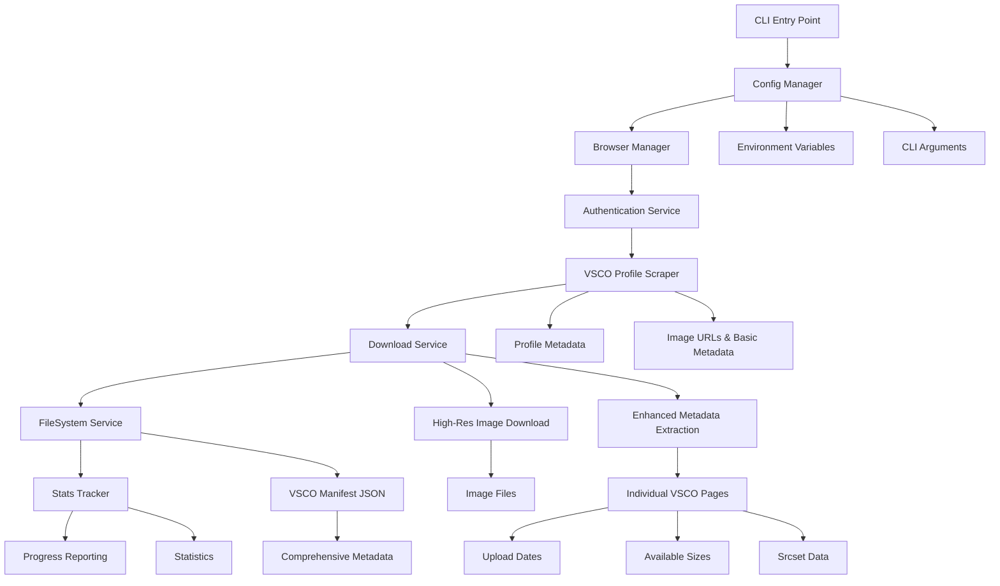
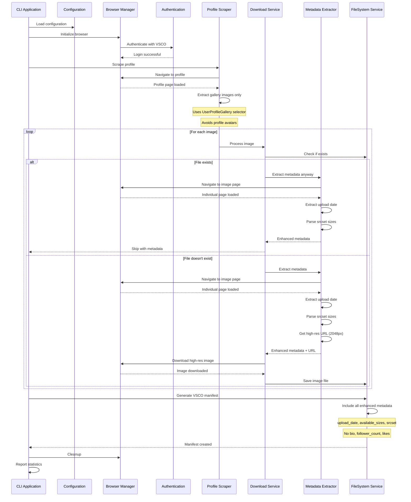

# 🎭 Playwright VSCO Downloader

A sophisticated TypeScript-based Playwright service for downloading images from VSCO using browser automation. Built with a modular service architecture.

## ✨ Features

- **🔐 Smart Authentication**: Automatic login to VSCO with fallback to manual login
- **🎯 Profile Scraping**: Extracts images exclusively from VSCO gallery, avoiding profile avatars
- **📅 Enhanced Metadata Extraction**: Extracts upload dates, available image sizes, and srcset from individual VSCO pages
- **📊 High-Resolution Downloads**: Downloads original quality images (up to 2048px) instead of thumbnails
- **🚀 Concurrent Downloads**: Parallel processing with configurable concurrency (1-10 workers)
- **⚡ Intelligent Batching**: Smart batch processing with rate limiting to respect VSCO's terms
- **🌐 Browser Pool Management**: Efficient browser context pooling for optimal resource usage
- **📈 Performance Optimized**: Up to 10x faster downloads with concurrent processing
- **🔄 Retry Logic**: Robust retry mechanism with exponential backoff per worker
- **📊 Progress Tracking**: Real-time progress reporting across all concurrent workers
- **🎯 Selective Downloads**: Skip already downloaded images automatically (with metadata extraction)
- **📝 Rich Manifest Generation**: Creates comprehensive VSCO manifest with detailed metadata
- **🖥️ Debug Mode**: Visual debugging with DevTools support
- **⚙️ Highly Configurable**: Extensive configuration options via CLI or environment
- **🏗️ Modular Architecture**: Service-oriented design with dependency injection
- **📘 TypeScript**: Full type safety with comprehensive type definitions
- **🔥 Hot Reload**: Development mode with instant TypeScript compilation
- **🧪 Testing**: Playwright test framework integration
- **⚖️ Rate Limiting**: Intelligent throttling to maintain VSCO compliance

## 🚀 Quick Start

### Prerequisites

- Node.js 18+
- A VSCO account (optional but recommended for authentication)
- VSCO username(s) you want to download images from

### Installation

1. Navigate to the tool directory:

```bash
cd playwright-vsco-downloader
```

2. Install dependencies:

```bash
pnpm install
```

3. Install Playwright browsers:

```bash
pnpm run install-browsers
```

4. Set up environment variables:

```bash
cp .env.example .env
# Edit .env with your credentials
```

### Basic Usage

```bash
# Download from a VSCO profile (headless mode) using concurrent mode (3 workers)
pnpm run download --username photographer123

# Or use as positional argument
pnpm run download photographer123

# Development mode with hot reload
pnpm run download:dev --username photographer123

# Download with visible browser (useful for debugging/manual login)
pnpm run download --username photographer123 --no-headless

# Support for VSCO URLs
pnpm run download --username "https://vsco.co/photographer123"

# Check environment setup
pnpm run download --check

# Download with custom settings
pnpm run download --username photographer123 --timeout 45000 --retries 5 --limit 10

# Limit number of images downloaded
pnpm run download --username photographer123 --limit 50
```

## ⚡ Performance & Concurrency

### 🚀 Concurrent Downloads

The tool supports concurrent downloads for significantly improved performance:

```bash
# Default concurrent mode (3 workers)
pnpm run download --username photographer123

# High-performance mode (10 concurrent workers)
pnpm run download --username photographer123 --concurrency 10

# Conservative mode (5 workers with larger batches)
pnpm run download --username photographer123 --concurrency 5 --batch-size 8

# Custom batch processing
pnpm run download \
  --username photographer123 \
  --concurrency 4 \
  --batch-size 3 \
  --delay-between-batches 2000

# Disable batching (process all at once with concurrency limit)
pnpm run download --username photographer123 --concurrency 5 --no-batching

# Sequential mode (1 worker)
pnpm run download --username photographer123 --concurrency 1
```

### 📊 Performance Comparison

| Mode | Workers | Typical Speed | Best For |
|------|---------|---------------|----------|
| **Sequential** | 1 | 1x | Very conservative, debugging |
| **Default Concurrent** | 3 | ~3x faster | Balanced performance & stability |
| **High Performance** | 5-7 | ~5-7x faster | Large downloads, good connection |
| **Maximum** | 10 | ~10x faster | Powerful systems, excellent connection |

### ⚙️ Concurrency Options

- **`-c, --concurrency <number>`**: Maximum concurrent downloads (1-10, default: 3)
- **`--batch-size <number>`**: Images per batch (default: same as concurrency)
- **`--delay-between-batches <number>`**: Delay between batches in milliseconds (default: 1000ms)
- **`--no-batching`**: Disable batch processing, process all images at once with concurrency limit

### 🎯 Smart Defaults

- **Concurrency**: 3 workers (optimal balance of speed vs. resource usage)
- **Batching**: Enabled by default to respect VSCO rate limits
- **Batch Size**: Equals concurrency setting (e.g., 3 workers = 3 images per batch)
- **Delays**: 1 second between batches to prevent rate limiting

### 🧠 Intelligent Features

- **Browser Pool Management**: Reuses browser contexts efficiently
- **Context Lifecycle**: Automatic cleanup of stale browser contexts
- **Error Isolation**: Failed downloads don't affect other workers
- **Resource Optimization**: Memory-efficient context pooling
- **Rate Limit Compliance**: Smart batching prevents VSCO server overload

### 💡 Usage Recommendations

**For Small Downloads (< 20 images):**
```bash
pnpm run download --username photographer123 --concurrency 3
```

**For Medium Downloads (20-100 images):**
```bash
pnpm run download --username photographer123 --concurrency 5 --batch-size 4
```

**For Large Downloads (100+ images):**
```bash
pnpm run download --username photographer123 --concurrency 7 --batch-size 5 --delay-between-batches 1500
```

**For Maximum Speed (powerful systems):**
```bash
pnpm run download --username photographer123 --concurrency 10 --no-batching
```

**For Debugging/Conservative:**
```bash
pnpm run download --username photographer123 --concurrency 1 --no-headless --debug
```

## 📋 Commands

### Main Download Command

```bash
pnpm run download [username] [options]
# or
pnpm run download --username <username> [options]
```

**Options:**

- `-u, --username <username>`: VSCO username to scrape (required)
- `-h, --headless`: Run in headless mode (default: true)
- `--no-headless`: Run with visible browser
- `-d, --debug`: Enable debug mode with DevTools
- `-t, --timeout <number>`: Timeout in milliseconds (default: 30000)
- `-r, --retries <number>`: Number of retry attempts (default: 3)
- `-l, --limit <number>`: Limit the number of images to download
- `--download-dir <path>`: Download directory
- `--dry-run`: Show what would be downloaded without downloading

**Concurrency & Performance Options:**

- `-c, --concurrency <number>`: Maximum concurrent downloads (1-10, default: 3)
- `--batch-size <number>`: Images per batch (default: same as concurrency)
- `--delay-between-batches <number>`: Delay between batches in milliseconds (default: 1000)
- `--no-batching`: Disable batch processing (process all at once with concurrency limit)

### Environment Check

```bash
pnpm run download -- check
```

Validates your environment configuration and shows the status of required/optional environment variables.

## 🛠️ Development

### TypeScript Development Scripts

```bash
# Development mode (uses tsx for hot reload)
pnpm run download:dev

# Build TypeScript to JavaScript
pnpm run build

# Build in watch mode (rebuilds on file changes)
pnpm run build:watch

# Type checking without compilation
pnpm run type-check

# Clean build artifacts
pnpm run clean
```

### Architecture

The tool is built with a modular TypeScript architecture featuring:

- **Service-Oriented Design**: Each major functionality is encapsulated in a dedicated service class
- **Dependency Injection**: Services are injected through constructors for better testability
- **Type Safety**: Comprehensive TypeScript types ensure runtime reliability
- **Command Pattern**: CLI commands are implemented as separate classes with a common interface
- **Configuration Management**: Centralized configuration with environment variable support
- **Error Boundaries**: Structured error handling with detailed logging and recovery mechanisms

### API Usage

The tool can be used programmatically:

```typescript
import { PlaywrightImageDownloader, Config } from "./src/index.js";

// Simple usage
const downloader = new PlaywrightImageDownloader({
  headless: false,
  debug: true,
  timeout: 45000,
});

const result = await downloader.run();
console.log("Downloaded:", result.stats.downloaded, "images");

// Advanced usage with individual services
import {
  BrowserManager,
  ManifestService,
  DownloadService,
  FileSystemService,
} from "./src/index.js";

const config = new Config({ timeout: 60000 });
const browserManager = new BrowserManager(config);
const fsService = new FileSystemService(config);
const manifestService = new ManifestService(config, fsService);
const downloadService = new DownloadService(config, browserManager, fsService, statsTracker);

// Custom workflow implementation
await browserManager.initialize();
const { imageEntries } = await manifestService.getProcessedImageEntries();
// ... custom processing
await browserManager.cleanup();
```

## ⚙️ Configuration

### Environment Variables

Create a `.env` file based on `.env.example`:

```bash
# Optional (enables auto-login)
VSCO_EMAIL=your_email@example.com
VSCO_PASSWORD=your_password_here

# Optional configuration overrides
PLAYWRIGHT_TIMEOUT=30000
PLAYWRIGHT_RETRIES=3
PLAYWRIGHT_LIMIT=0
PLAYWRIGHT_HEADLESS=true
PLAYWRIGHT_DEBUG=false
```

### Command Line Overrides

All environment variables can be overridden via command line:

```bash
pnpm run download \
  --timeout 45000 \
  --retries 2 \
  --no-headless \
  --debug
```

## 🔐 Authentication

The tool supports multiple authentication approaches:

### 1. Automatic Login (Recommended)

Set `VSCO_EMAIL` and `VSCO_PASSWORD` in your `.env` file. The tool will automatically log in to VSCO.

### 2. Manual Login

If credentials are not provided, you can:

- Run with `--no-headless` to see the browser
- The tool will pause and wait for you to log in manually
- Press Enter in the terminal when login is complete

### 3. No Authentication

The tool can work without authentication, but download quality and availability may be limited.

## 📁 File Organization

```
playwright-vsco-downloader/
├── src/                           # TypeScript source files
│   ├── index.ts                   # Public API entry point
│   ├── cli.ts                     # CLI application entry point
│   ├── PlaywrightImageDownloader.ts # Main orchestrator class
│   ├── api/
│   │   └── VscoAPIService.ts      # VSCO API integration
│   ├── auth/
│   │   └── AuthenticationService.ts # VSCO authentication logic
│   ├── browser/
│   │   └── BrowserManager.ts      # Playwright browser lifecycle
│   ├── cli/
│   │   ├── CliApplication.ts      # CLI framework and routing
│   │   ├── EnvironmentChecker.ts  # Environment validation
│   │   ├── OptionParser.ts        # Command line argument parsing
│   │   ├── OutputFormatter.ts     # Console output formatting
│   │   └── commands/              # Individual CLI commands
│   ├── config/
│   │   └── Config.ts              # Configuration management
│   ├── download/
│   │   └── DownloadService.ts     # Image download logic
│   ├── fs/
│   │   └── FileSystemService.ts   # File operations
│   ├── manifest/
│   │   └── ManifestService.ts     # Manifest processing
│   ├── stats/
│   │   └── StatsTracker.ts        # Progress and metrics tracking
│   └── types/
│       └── index.ts               # TypeScript type definitions
├── dist/                          # Compiled JavaScript output
├── tsconfig.json                  # TypeScript configuration
├── playwright.config.js           # Playwright test configuration
├── package.json                   # Dependencies and scripts
├── .env.example                   # Environment template
├── .gitignore                     # Git ignore rules
└── README.md                      # This file
```

## 🔄 How It Works

### System Overview

Since VSCO doesn't allow direct scraping, this tool uses a combination of:

1. **VSCO API Integration**: Fetches public metadata when available
2. **Browser Automation**: Navigates to VSCO pages to extract image URLs
3. **Authenticated Sessions**: Uses login sessions to access higher quality images
4. **Rate Limiting**: Sequential processing with delays to respect VSCO's terms

### System Architecture



### Enhanced Processing Flow



### Detailed Processing Steps

1. **Initialization**: Launches a Chromium browser instance with optimized settings
2. **Username Validation**: Cleans and validates the provided VSCO username
3. **Authentication**: Handles login to VSCO (automatic or manual)
4. **Profile Scraping**:
   - Navigates to the VSCO profile page
   - Uses `[data-testid="UserProfileGallery"]` selector to target only gallery images
   - Avoids profile pictures and avatars
   - Loads image grid with infinite scroll handling
   - Extracts image URLs and basic metadata from each image
5. **Enhanced Metadata Extraction**:
   - For each image (including existing files), navigates to individual VSCO page
   - Extracts upload date from `<time datetime>` elements
   - Parses `srcset` attribute to get all available image sizes
   - Obtains high-resolution image URLs (up to 2048px)
6. **Image Processing**:
   - Checks if image already exists locally
   - Downloads high-resolution images with proper naming
   - Applies enhanced metadata to all images (downloaded or skipped)
7. **Retry Logic**: Automatically retries failed downloads with exponential backoff
8. **VSCO Manifest Creation**: Generates comprehensive manifest with enhanced metadata
9. **Cleanup**: Closes browser and reports comprehensive statistics

### Generated Manifest Structure

The tool generates a comprehensive VSCO manifest with enhanced metadata:

```json
{
  "generated_at": "2025-08-28T10:02:26.556Z",
  "version": "1.0.0-vsco",
  "source": "vsco_profile_scraper",
  "download_method": "playwright",
  "profile": {
    "username": "photographer123",
    "display_name": "Amazing Photographer",
    "profile_url": "https://vsco.co/photographer123",
    "total_images_found": 45
  },
  "images": {
    "photographer123/60f6042f56ee7b3727dc1786": {
      "local_path": "/public/images/vsco/photographer123/60f6042f56ee7b3727dc1786.jpg",
      "filename": "60f6042f56ee7b3727dc1786.jpg",
      "file_size_bytes": 1472503,
      "downloaded_at": "2025-08-28T10:02:26.557Z",
      "skipped": false,
      "vsco_image_id": "60f6042f56ee7b3727dc1786",
      "vsco_image_url": "https://vsco.co/photographer123/media/60f6042f56ee7b3727dc1786",
      "vsco_profile_url": "https://vsco.co/photographer123",
      "direct_image_url": "https://im.vsco.co/aws-us-west-2/.../vsco60f604326085a.jpg?w=2048&dpr=1",
      "thumbnail_url": "//im.vsco.co/aws-us-west-2/.../vsco60f604326085a.jpg?w=480",
      "width_px": 2048,
      "height_px": 1536,
      "dimensions": "2048 x 1536",
      "author": "Amazing Photographer",
      "vsco_username": "photographer123",
      "upload_date": "2021-07-19T23:01:06.386Z",
      "available_sizes": [
        "300w", "480w", "600w", "640w", "960w", "1136w", "1200w"
      ],
      "srcset": "//im.vsco.co/.../vsco60f604326085a.jpg?w=300 300w, //im.vsco.co/.../vsco60f604326085a.jpg?w=480 480w, //im.vsco.co/.../vsco60f604326085a.jpg?w=600 600w, //im.vsco.co/.../vsco60f604326085a.jpg?w=640 640w, //im.vsco.co/.../vsco60f604326085a.jpg?w=960 960w, //im.vsco.co/.../vsco60f604326085a.jpg?w=1136 1136w, //im.vsco.co/.../vsco60f604326085a.jpg?w=1200 1200w",
      "download_method": "playwright",
      "extracted_at": "2025-08-28T10:02:26.557Z"
    }
  },
  "stats": {
    "total_images": 1,
    "downloaded": 1,
    "failed": 0,
    "skipped": 0,
    "success_rate": 100,
    "duration_seconds": 0
  }
}
```

### Enhanced Metadata Features

**Profile Data:**
- Clean profile structure without unnecessary fields
- Focuses on essential information: username, display name, profile URL, and image count

**Image Metadata:**
- **Upload Date**: Extracted from `<time datetime>` elements on individual VSCO pages
- **Available Sizes**: Parsed from `srcset` attribute showing all resolution options
- **Srcset Data**: Complete responsive image data for different screen densities
- **High-Resolution URLs**: Direct links to highest quality images (up to 2048px)
- **File Information**: Local paths, sizes, and download timestamps
- **VSCO Integration**: Direct links to original VSCO pages and profiles

## 📊 Output

The tool provides comprehensive output including:

- Real-time download progress
- Success/failure statistics
- File sizes and storage usage
- Detailed error reporting for failed downloads
- Local manifest creation

Example output:

```
🚀 Starting downloads for 5 images...

📥 [1/5] Processing: user1/abc123
🌐 Navigating to: https://vsco.co/user1/gallery/abc123
📸 Extracted image URL: https://image-aws-us-west-2.vsco.co/...
✅ Downloaded: user1_abc123.jpg (2.34 MB)

⏭️ Skipped (exists): user2_def456.jpg

📊 Download Results:
   ✅ Successfully downloaded: 4
   ⏭️  Skipped (already exist): 1
   ❌ Failed to download: 0
   ⏱️  Total time: 45.2s
   💾 Storage used: 12.67 MB
```

## 🐛 Troubleshooting

### Common Issues

**"Could not extract image URL from VSCO page"**

- The page layout may have changed
- Try running with `--no-headless --debug` to inspect the page
- Check if manual login is required

**"Timeout waiting for download"**

- Increase timeout: `--timeout 60000`
- Check internet connection
- Some images may be larger and take longer

**"Login failed"**

- Verify credentials in `.env` file
- Try manual login with `--no-headless`
- Check if 2FA is enabled (not currently supported)

**"Browser crashes"**

- Ensure sufficient system resources
- Update Playwright browsers: `pnpm run install-browsers`

### Debug Mode

Run with debug flags for troubleshooting:

```bash
pnpm run download --no-headless --debug
```

This will:

- Show the browser window
- Opens Browser DevTools
- Provide detailed error information

## 🔧 Advanced Usage

### Custom Download Directory

```bash
pnpm run download \
  --username photographer123 \
  --download-dir /path/to/download/folder
```

### Integration with Main Project

Add this to your main project's `package.json`:

```json
{
  "scripts": {
    "download:images:vsco": "cd tools/playwright-vsco-downloader && pnpm run download"
  }
}
```

Then run from your main project:

```bash
pnpm run download:images:vsco
```

## ⚠️ Important Notes

- **Concurrent Processing**: Supports concurrent downloads (1-10 workers) with intelligent batching for optimal performance
- **Rate Limiting**: Smart batching and delays respect VSCO's terms of service while maximizing download speed
- **Resource Management**: Browser context pooling optimizes memory usage and prevents resource exhaustion
- **Authentication**: While authentication is optional, it may provide access to higher quality images
- **API Usage**: Uses VSCO's public endpoints and browser automation, not private APIs
- **Respect Terms**: Always respect VSCO's terms of service and the rights of image creators
- **Quality**: Image quality depends on what VSCO serves publicly vs. to authenticated users
- **System Resources**: Higher concurrency settings require more system resources (RAM, CPU, network)

## 🤔 Differences from Unsplash Version

1. **API Access**: VSCO has limited public API, so more browser automation is required
2. **Authentication**: Different login flow and credential handling
3. **Rate Limiting**: More conservative approach to respect VSCO's terms
4. **URL Structure**: Different URL patterns and image ID extraction
5. **Metadata**: Different metadata structure and availability

## 🤝 Contributing

1. Fork the repository
2. Create a feature branch
3. Make your changes
4. Test thoroughly with VSCO content
5. Submit a pull request

## 📄 License

This tool is part of the main project and follows the same license terms.

## ⚖️ Legal & Ethical Use

This tool is designed for legitimate use cases such as:

- Downloading your own VSCO content
- Archiving images you have permission to download
- Educational and research purposes

Please ensure you:

- Respect VSCO's terms of service
- Respect image creators' rights and copyrights
- Use the tool responsibly and ethically
- Do not use for mass scraping or commercial exploitation

The developers are not responsible for misuse of this tool.
